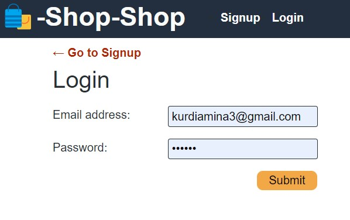
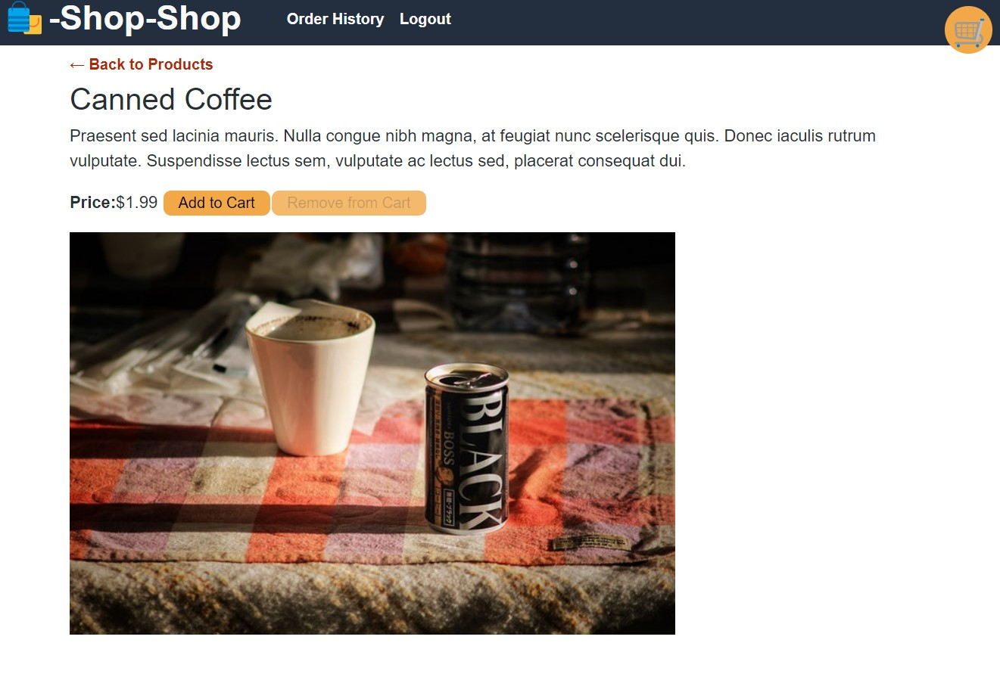
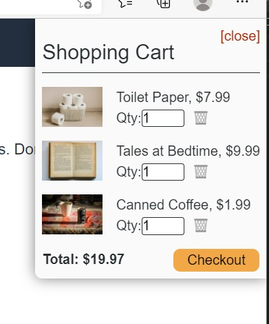

 
  # <h1 align="center"> 🌻 Shop-Shop  🌻 <h1>
  
----

## Table of Contents
- [Description](#description)
- [Installation](#installation)
- [Issues](#issue)
- [Contribution](#contribution)
- [Test Instructions](#test-instructions)
- [Questions](#questions)

----

### Description
This project takes an existing project that uses React's Context API to manage global state, and refactor it so that it uses Redux.The application allows you to log in/out, select from a list of categories and products, from there you can view the product, description, and price and you have the option to add it to the cart. This application also uses Swipe, so that you may checkout your cart. This application is deployed on Heroku. [Click Here.](https://git.heroku.com/fathomless-gorge-57324.git)

----
### Installation
🔧React, Redux

----
### Issues While Developing
✏️One issue I ran into was installing my dependencies. For some reason I could not figure out why 'npm install' was not working, and infact was trying to install Python for some reason... I know it sounds insane, but its true. I looked it over with a TA, and they determined that the command needs to include the word 'run' in it. So instead of 'npm install' or 'npm develop', it needs to be 'npm run install' and 'npm run develop' etc... So in that situation I thought I was going crazy cause it was the beginning of the module, I installed the one starter code they said, and was told to 'npm install'. I spent 2 days googling on my own before I even had a chance to speak with a TA, so I was suffering quietly. 

----
### License
✅
This application is covered by the Apache License 2.0 license.
----

### Contributing
🤝Amina Kurdi, and my TA

----
### Test-Instructions
Tested the reducers

----
### Questions
💻Find me on GitHub: [Github Profile](https://github.com/kurdiamina3)
 
📧Email me with any questions: kurdiamina3@gmail.com 
 

🌟_This README was generated with 💓 by [README-generator] (https://github.com/kurdiamina3/README-generator)🌟

